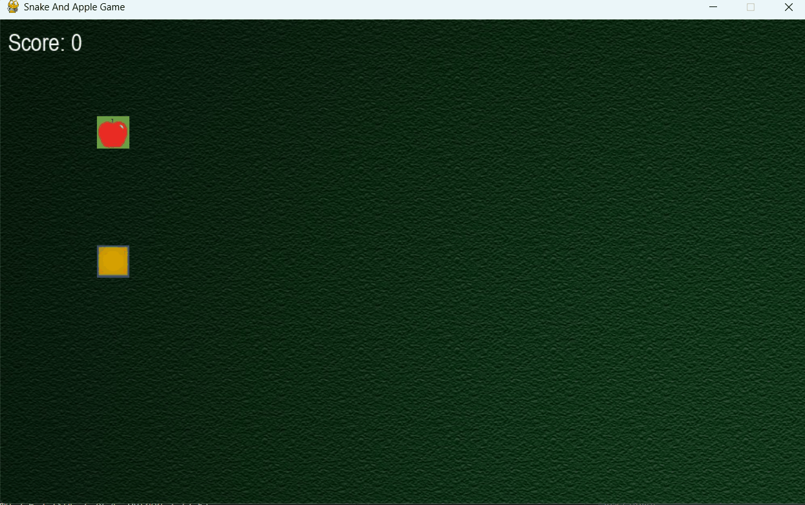

# 🐍 Python Snake Game

A classic snake game built using Python.  
Control the snake, eat the food, and grow longer without hitting the snake itself!

## 🎮 Features
- Built using `pygame`
- Intuitive keyboard controls (Arrow keys)
- Real-time score tracking
- Game over logic with restart option
- Backound sound added

## Preview

  # 💬 Note
  This game was created as a learning project and demonstrates basic game mechanics, event loops, and collision detection in Python.

